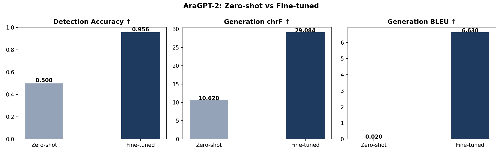

<p align="right" dir="rtl">
  <strong>عامية: "يلا فين؟" &nbsp;→&nbsp; فصحى: "إلى أين تذهب؟"</strong>
</p>

# SlangGPT — Egyptian Arabic → Modern Standard Arabic

Fine-tuning **AraGPT-2** for two tasks:  
**Generation** (Egyptian slang → formal MSA) and **Detection** (does this translation hold?).  
Built as an extension of the Stanford CS224N default project framework, adapted for Arabic dialect NLP.

---

## Results

| Task       | Model               | Metric            | Score                  |
| ---------- | ------------------- | ----------------- | ---------------------- |
| Detection  | Zero-shot AraGPT-2  | Accuracy          | 0.500                  |
| Detection  | Fine-tuned AraGPT-2 | Accuracy          | **0.956**              |
| Generation | Zero-shot AraGPT-2  | chrF / BLEU / PPL | 10.62 / 0.02 / 728,108 |
| Generation | Fine-tuned AraGPT-2 | chrF / BLEU / PPL | **29.08 / 6.63 / —**   |

Fine-tuning improves detection accuracy by **+45.6 points** and chrF by **+18.5 points** over zero-shot baselines.



---

## Dataset

**Egyptian Arabic Slang ↔ Formal Arabic**  
18,250 parallel sentence pairs mapping Egyptian Arabic dialect to Modern Standard Arabic (MSA).

| Split       | Rows    |
| ----------- | ------- |
| Train (80%) | ~14,600 |
| Dev (10%)   | ~1,825  |
| Test (10%)  | ~1,825  |

**Download:**

- 🤗 Hugging Face: [AdhamAshraf/egyptian-2-arabic](https://huggingface.co/datasets/AdhamAshraf/egyptian-2-arabic)
- 📦 Kaggle: [adhamashraf77/egyptian-2-arabic](https://www.kaggle.com/datasets/adhamashraf77/egyptian-2-arabic)

**Source & Derivation:**  
Derived from [Abdalrahmankamel/Egyption_2_English](https://huggingface.co/datasets/Abdalrahmankamel/Egyption_2_English).  
The original dataset paired Egyptian Arabic with English translations. This version repurposes the Egyptian Arabic content for Dialect → MSA conversion with the following modifications:

- Removed English translation column
- Added Modern Standard Arabic translations
- Applied Arabic normalization and diacritic (tashkeel) removal
- Reformatted for NLP dialect-to-MSA tasks

**Citation:**

```bibtex
@dataset{egyptian_arabic_slang_formal_2026,
  author    = {AdhamAshraf},
  title     = {Egyptian Arabic Slang to Formal Arabic Dataset},
  year      = {2026},
  publisher = {Hugging Face},
  url       = {https://huggingface.co/datasets/AdhamAshraf/egyptian-2-arabic}
}

@dataset{egyptian_english_original,
  author    = {Abdalrahmankamel},
  title     = {Egyption\_2\_English},
  year      = {2024},
  publisher = {Hugging Face},
  url       = {https://huggingface.co/datasets/Abdalrahmankamel/Egyption_2_English}
}
```

---

## Project Structure

```
SlangGPT/
├── app/                        # Flask web app
│   ├── app.py                  # Web server
│   ├── model.py                # Model loading & inference
│   ├── templates/index.html    # Web UI
│   └── static/style.css        # Styles
├── data/
│   ├── prepare_data.py         # Preprocessing pipeline
│   ├── raw/NLP.csv             # Raw dataset (git-ignored)
│   └── processed/              # Train/dev/test splits (git-ignored)
├── evaluation/
│   ├── baseline.py             # Zero-shot baseline evaluation
│   ├── evaluate.py             # Fine-tuned model evaluation + plots
│   ├── error_analysis.py       # FP/FN error analysis
│   └── plots/                  # Results CSVs and figures
├── model/
│   ├── config.py               # Central config (paths + hyperparams)
│   ├── train_generation.py     # Generation training script
│   ├── train_detection.py      # Detection training script
│   └── weights/                # Trained model weights (git-ignored)
├── notebooks/                  # Colab training notebooks (git-ignored)
│   ├── 01_preprocessing.ipynb
│   ├── 02_train_generation.ipynb
│   └── 03_train_detection.ipynb
├── scripts/
│   └── download_weights.py     # Download weights from Google Drive
└── report/
    └── main.tex                # LaTeX report
```

---

## Quickstart

### 1. Clone & install

```bash
git clone https://github.com/adhamashraf7788/SlangGPT.git
cd SlangGPT
pip install -r requirements.txt
```

### 2. Download model weights

```bash
python scripts/download_weights.py
```

This places weights under `model/weights/detection/` and `model/weights/generation/best/`.

### 3. Download & preprocess the dataset

```python
from datasets import load_dataset
dataset = load_dataset("AdhamAshraf/egyptian-2-arabic", split="train")
df = dataset.to_pandas()
df.to_csv("data/raw/NLP.csv", index=False, encoding="utf-8-sig")
```

Then run:

```bash
python data/prepare_data.py --raw_csv data/raw/NLP.csv
```

### 4. Run the web app

```bash
python app/app.py
```

Open `http://localhost:5000` — enter an Egyptian Arabic sentence to get the MSA translation and a detection confidence score.

---

## Training (Colab)

Open the notebooks in order on Google Colab:

| Notebook                    | Purpose                           |
| --------------------------- | --------------------------------- |
| `01_preprocessing.ipynb`    | Download dataset, clean, split    |
| `02_train_generation.ipynb` | Fine-tune AraGPT-2 for generation |
| `03_train_detection.ipynb`  | Fine-tune AraGPT-2 for detection  |

All notebooks mount Google Drive and save checkpoints automatically.

---

## Models

Both models are based on **AraGPT-2** from [aubmindlab](https://huggingface.co/aubmindlab):

| Task       | Base Model                  | Parameters |
| ---------- | --------------------------- | ---------- |
| Generation | `aubmindlab/aragpt2-medium` | ~355M      |
| Detection  | `aubmindlab/aragpt2-base`   | ~135M      |

**Generation** uses causal language modeling with prompt masking — only the formal Arabic target tokens contribute to the loss.  
**Detection** uses the last-token hidden state of the GPT-2 backbone fed into a linear classifier head, following the cloze-style formulation from the Stanford CS224N paper.

---

## Evaluation

```bash
# Zero-shot baseline
python evaluation/baseline.py

# Fine-tuned model evaluation
python evaluation/evaluate.py

# Error analysis (FP/FN, worst/best examples)
python evaluation/error_analysis.py
```

Results are saved to `evaluation/plots/`.

---

## Related Work

This project extends the approach from:

> Hernandez & Naik, _Extending GPT-2 for Informal and Slang Aware Language Understanding_, Stanford CS224N, 2025.

Which itself builds on:

- Radford et al., [GPT-2](https://openai.com/research/language-unsupervised), 2019
- Sun et al., [Toward Informal Language Processing](https://arxiv.org/abs/2404.02323), 2024

---

## License

MIT
